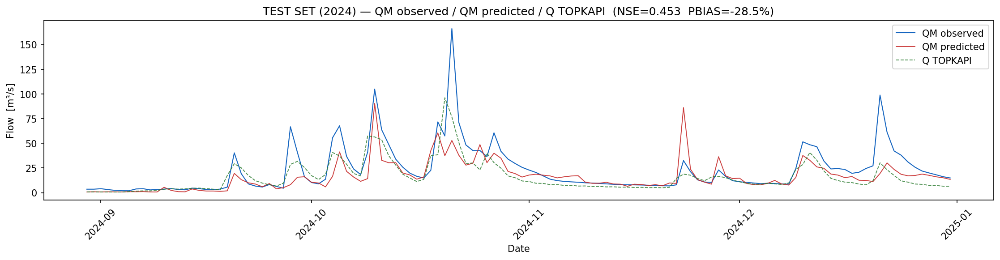

# PatchTST Streamflow Prediction — Sorbolo Basin

A deep-learning streamflow forecasting model for the **Sorbolo river basin** (Emilia-Romagna, Italy), built with the [PatchTST](https://arxiv.org/abs/2211.14730) transformer architecture. The model predicts daily observed discharge (QM, m³/s) from meteorological and hydrological inputs and is benchmarked against the TOPKAPI physics-based model.

---

## Results at a glance

| Evaluation Set | NSE | PBIAS | NSE_peak (top 10%) | Rating |
|---|---|---|---|---|
| Full dataset (2014–2024) | **0.894** | −4.2 % | 0.711 | 🟢 Excellent |
| Test set (Jul–Dec 2024) | 0.499 | −24.1 % | −1.317 | 🟡 Satisfactory / ⚠️ Poor at peaks |

> NSE > 0.8 = excellent · NSE 0.36–0.60 = satisfactory · NSE < 0 = worse than mean

---

## Test set time series (Jul–Dec 2024)



*Blue = QM observed · Red = QM predicted · Dashed green = Q TOPKAPI*

---

## Project structure

```
sorbolo_patchtst/
├── data/
│   ├── raw/
│   │   └── Sorbolo.csv          # raw input (not tracked)
│   └── processed/               # generated by 1__prepare_data.py
│       ├── X_train.npy / Y_train.npy
│       ├── X_val.npy   / Y_val.npy
│       ├── X_test.npy  / Y_test.npy
│       ├── X_all.npy   / Y_all.npy
│       ├── scaler_X.pkl / scaler_y1.pkl
│       ├── QM_TRAIN_MAX.npy
│       ├── test_reference.csv
│       └── all_reference.csv
├── models/
│   └── best_model.pt            # saved by 2__train.py
├── outputs/
│   └── plots/                   # generated by 3__evaluate.py
├── 1__prapare_data.py
├── 2__train.py
├── 3__evaluate.py
└── LSTM.ini                     # configuration file
```

---

## Pipeline

### 1 · Data preparation — `1__prapare_data.py`

- Loads `Sorbolo.csv` (daily timestep, separator `;`)
- Filters from `start_date = 2014-01-01`; drops rows where QM = −9999
- Stores TOPKAPI output (Q) separately — it is **not** used as a model input to prevent data leakage
- Drops columns: `Q, Deep, DeepSat, Inf2Surf, EnSnow, Surf`
- Adds 6 lagged discharge features: QM_lag1/2/3/7/14/21
- Fits `StandardScaler` on the training set only; applies to val/test/full
- Target uses two heads: log-scaled QM (standardised) and QM normalised by training max
- Creates sliding windows of length 60; applies **×8 flood augmentation** for QM > 50 m³/s

**Dataset splits (temporal, no leakage):**

| Split | Period | Rows | QM max (m³/s) | Events > 50 m³/s |
|---|---|---|---|---|
| Training | 2014-01-22 – 2023-12-31 | 3,631 | 323.6 | 112 |
| Validation | 2024-01-01 – 2024-06-30 | 182 | 237.7 | 26 |
| Test | 2024-07-01 – 2024-12-31 | 184 | 166.2 | 13 |

After augmentation the training set grows to **4,331 sequences** (3,571 original + 760 duplicated flood windows).

---

### 2 · Training — `2__train.py`

Model architecture (configured in `LSTM.ini` under `[patchtst]`):

| Hyperparameter | Value |
|---|---|
| Input features | 17 |
| Sequence length | 60 time steps |
| Patch length / Stride | 10 / 5 → 11 patches |
| d_model | 128 |
| Attention heads | 4 |
| Transformer layers | 4 |
| Feed-forward dim | 512 |
| Dropout | 0.10 |
| Total parameters | 7,037,954 |

Training configuration:

| Setting | Value |
|---|---|
| Batch size | 64 |
| Max epochs | 400 |
| Learning rate | 3 × 10⁻⁴ (cosine schedule) |
| Early stopping patience | 80 epochs |
| Loss weights (log / norm) | 0.3 / 1.0 |
| Huber delta | 1.0 |

Training stopped at **epoch 170** (best val NSE = 0.546, val PBIAS = −30.0%).

---

### 3 · Evaluation — `3__evaluate.py`

Runs inference on the test set and full 2014–2024 dataset. Outputs:

- `predictions_test.csv` / `predictions_all.csv`
- 7 diagnostic plots per evaluation set (time series, scatter, residuals, flow duration curve, annual boxplots, loss curve, head comparison)

**Full dataset (2014–2024):**

| Metric | Value |
|---|---|
| RMSE | 5.78 m³/s |
| MAE | 2.04 m³/s |
| NSE | **0.894** |
| PBIAS | −4.2 % |
| RMSE_peak (top 10%, > 26.3 m³/s) | 16.85 m³/s |
| NSE_peak | 0.711 |

**Test set (Jul–Dec 2024):**

| Metric | Value |
|---|---|
| RMSE | 16.99 m³/s |
| MAE | 8.35 m³/s |
| NSE | 0.499 |
| PBIAS | −24.1 % |
| RMSE_peak (top 10%, > 50.8 m³/s) | 45.54 m³/s |
| NSE_peak | −1.317 |

---

## Key findings

**Strengths**
- NSE = 0.894 over the full decade confirms the model has learned the basin's dominant rainfall-runoff dynamics.
- Very low volume bias (PBIAS = −4.2%) across 10 years of daily predictions.
- Peak NSE = 0.711 on the full dataset shows acceptable skill for high-flow events within the training distribution.

**Limitations**
- Test-set NSE (0.499) is satisfactory but degrades substantially relative to the training period, indicating the model has not fully generalised to unseen 2024 conditions.
- Negative NSE_peak (−1.317) on the test set is the most critical issue: peak-flow predictions are worse than a naïve mean-flow forecast. The model cannot be used for operational flood warning in its current state.
- The November 2024 event (~160 m³/s observed) was severely under-predicted. Antecedent soil saturation combined with extreme convective rainfall produced a response outside the training distribution.
- Systematic negative PBIAS (−24.1%) on the test set reflects consistent under-prediction of high flows.

**TOPKAPI comparison**
TOPKAPI also under-predicts flood peaks (visible in the dashed green line in the plots). The PatchTST model generally tracks peaks more closely than TOPKAPI in the training window but shows similar or worse behaviour during the most extreme 2024 events.

---

## Potential improvements

- **More training data near 2024 extremes** — include 2024 Jan–Jun in training (currently used only for early stopping) or apply transfer learning from a neighbouring well-gauged catchment.
- **Post-processing bias correction** — fit a quantile-mapping or isotonic regression layer on validation peaks to reduce the systematic under-prediction.
- **Ensemble / probabilistic output** — replace point prediction with quantile regression or MC-dropout to bound uncertainty around peaks.
- **Hybrid physics + ML** — use TOPKAPI state variables (soil moisture, snow water equivalent) as additional inputs, or train on TOPKAPI residuals.
- **Higher-resolution forcing** — point-scale rainfall likely underestimates basin-wide convective totals; radar QPE or gridded products may improve peak representation.
- **Architecture ablation** — benchmark against N-HiTS, iTransformer, or TimesNet on the same temporal split.

---

## Configuration (`LSTM.ini`)

All paths and hyperparameters are controlled from `LSTM.ini` under the `[patchtst]` section:

```ini
[patchtst]
raw_csv          = data/raw/Sorbolo.csv
data_dir         = data/processed
model_dir        = models
out_dir          = outputs

target_code      = QM
start_date       = 2014-01-01

seq_len          = 60
patch_len        = 10
stride           = 5

d_model          = 128
n_heads          = 4
n_layers         = 4
d_ff             = 512
dropout          = 0.10

batch_size       = 64
epochs           = 400
lr               = 3e-4
patience         = 80
huber_delta      = 1.0
loss_w1          = 0.3
loss_w2          = 1.0

blend_threshold  = 15.0
blend_scale      = 10.0
```

---

## Requirements

```
python >= 3.10
torch
numpy
pandas
scikit-learn
matplotlib
```

Install dependencies:

```bash
pip install torch numpy pandas scikit-learn matplotlib
```

---

## Usage

```bash
# 1. Prepare data
python 1__prapare_data.py

# 2. Train
python 2__train.py

# 3. Evaluate
python 3__evaluate.py
```

Outputs (plots + CSVs) are written to the `out_dir` specified in `LSTM.ini`.

---

## References

- Nie, Y. et al. (2023). *A Time Series is Worth 64 Words: Long-term Forecasting with Transformers.* ICLR 2023. [arXiv:2211.14730](https://arxiv.org/abs/2211.14730)
- Nash, J.E. & Sutcliffe, J.V. (1970). River flow forecasting through conceptual models. *Journal of Hydrology*, 10(3), 282–290.
- Ciarapica, L. & Todini, E. (2002). TOPKAPI: a model for the representation of the rainfall-runoff process at different scales. *Hydrological Processes*, 16(2), 207–229.
